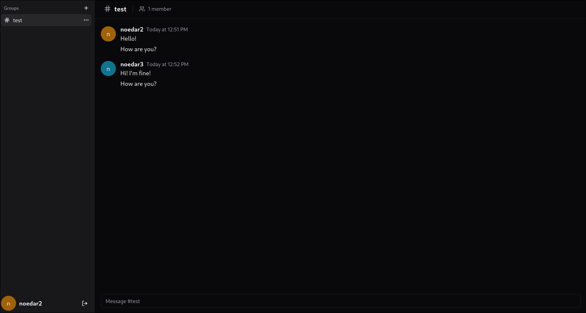
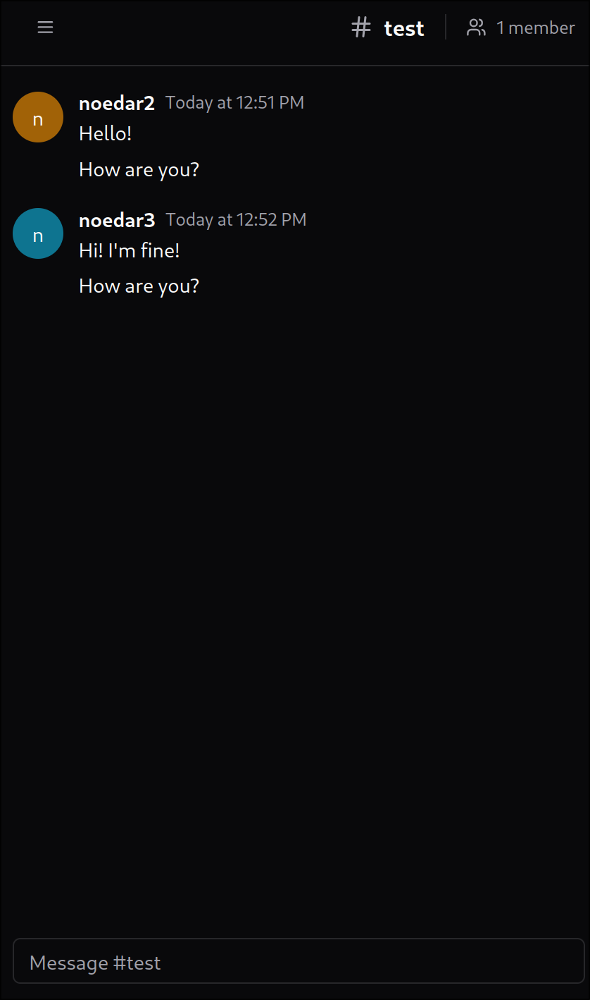
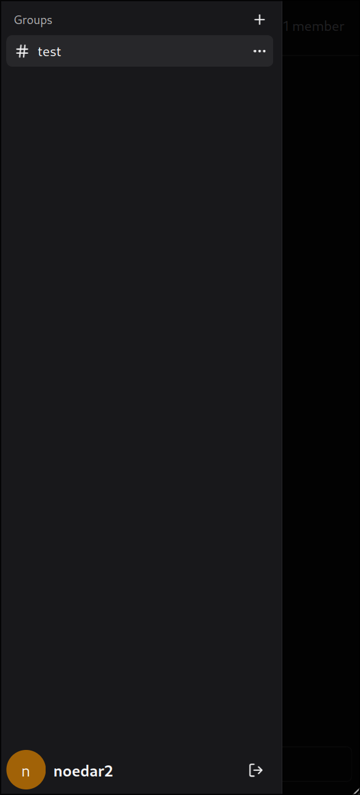

# Taqui
Simple messenger app written in Rust and Typescript

# Stack
## Frontend
- [Typescript](https://www.typescriptlang.org)
- [React 18](https://react.dev)
- [Shadcn UI](https://ui.shadcn.com) components
- [TailwindCSS](https://tailwindcss.com) for styling
- [Vite](https://vite.dev) for development and building
- [Tanstack Query](https://tanstack.com/query/latest) for data fetching
- [Tanstack Router](https://tanstack.com/router/latest) for routing
- [React Hook Form](https://react-hook-form.com) for form handling

## Backend
- [Rust](https://www.rust-lang.org/)
- [Axum Web Framework](https://github.com/tokio-rs/axum)
- PostgreSQL with [SQLx](https://github.com/launchbadge/sqlx)
- JWT authentication
- [Argon2](https://github.com/RustCrypto/password-hashes/tree/master/argon2) for password hashing
- Server-Sent Events for real-time updates

# Setup

## Prerequisites
- [Docker](https://www.docker.com)
- [Docker Compose](https://docs.docker.com/compose/install)

## Quick Start
1. Clone the repository
```bash
git clone https://github.com/Aern-do/taqui.git
cd taqui
```
2. Start the application
```bash
docker compose up -d
```

Once the containers are running, you can access the application at `http://localhost`

# Screenshots


